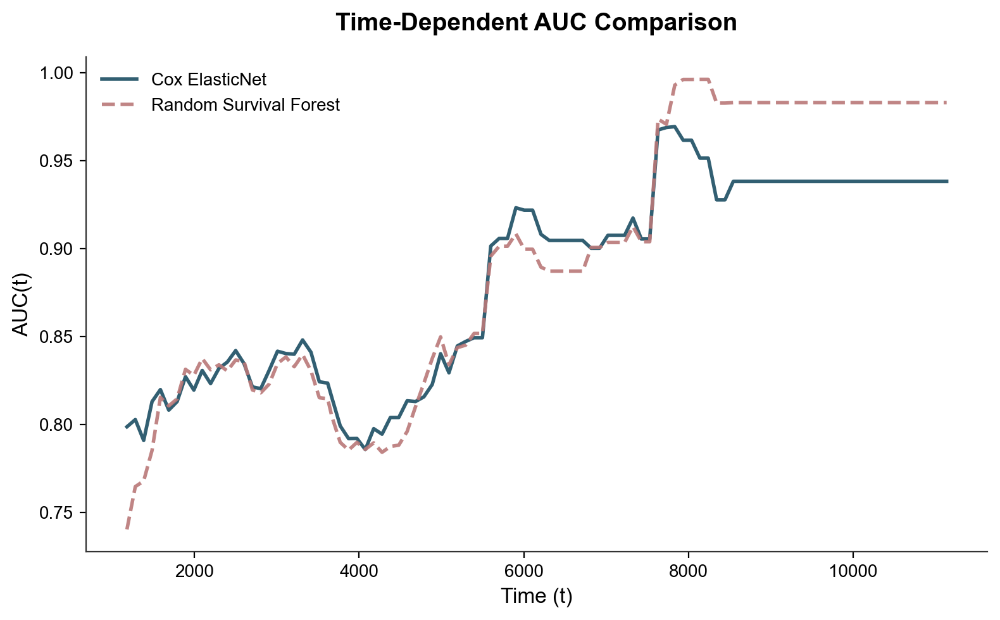

# SigBERT: Survival Analysis & Conformal Prediction


> **A rigorous implementation of Survival Analysis models coupled with Conformal Prediction to provide guaranteed uncertainty quantification in time-to-event data.**

## 🎯 Project Overview

In critical domains like healthcare, predicting *when* an event will occur is not enough; we must also know *how confident* we are.
**SigBERT** benchmarks state-of-the-art survival models and enhances them with **Censored Score Algebra (CSA)** to produce calibrated prediction intervals.

### Key Objectives
1.  **Benchmark**: Compare **Cox Proportional Hazards (ElasticNet)** vs. **Random Survival Forests (RSF)**.
2.  **Uncertainty**: Implement **Conformal Survival Analysis (CSA)** to generate valid finite-sample prediction intervals.
3.  **Reproducibility**: Modular, production-ready code structure with global seeding and robust data pipelines.

---

## 📊 Key Results

The models were evaluated on the **L36 Dataset** using rigorous Train/Calibration/Test splitting.

| Model | C-Index (Discriminative) | IBS (Calibration) | Integrated AUC |
| :--- | :---: | :---: | :---: |
| **Cox ElasticNet** | **0.755** | 0.085 | **0.831** |
| Random Survival Forest | 0.742 | **0.083** | 0.822 |

> *CoxPH demonstrates slightly better discrimination (C-Index), while RSF offers competitive calibration (IBS).*

### Performance Visuals
**Time-Dependent AUC**:


*The models maintain high discriminative power (>0.80 AUC) across most of the study timeline.*

---

## 🧠 Methodology

### 1. Robust Preprocessing
- **Stratified Split**: 50% Train / 30% Cali / 20% Test (stratified by event status).
- **Feature Selection**: Variance thresholding to remove low-signal features.
- **Imputation**: Median imputation for robustness.

### 2. Modeling
- **CoxPH**: Incorporates `ElasticNet` regularization (L1/L2) to handle high-dimensional signal data.
- **RSF**: Non-parametric ensemble method capturing non-linear interactions.

### 3. Conformal Prediction (CSA)
We implement **Censored Score Algebra** to provide prediction intervals $[L(x), U(x)]$ such that:
$$P(T \in [L(x), U(x)]) \ge 1 - \alpha$$
This allows us to flag "uncertain" patients where the interval is too wide to be clinically useful.

---

## 💻 Tech Stack

- **Core**: `Python 3.9+`, `NumPy`, `Pandas`
- **ML/Survival**: `scikit-survival`, `lifelines`, `scikit-learn`
- **Visualization**: `Matplotlib` (Publication-ready style)

## 🚀 Usage

### 1. Setup
```bash
git clone https://github.com/kwija/Sigbert-csa.git
cd Sigbert-csa
pip install -r requirements.txt
```

### 2. Run Pipeline
Generate all results and figures in one command:
```bash
python run_pipeline.py
```
*Outputs will be saved to the `results/` directory.*

### 3. Explore Notebooks
For a step-by-step walkthrough:
```bash
jupyter notebook notebooks/demo.ipynb
```

---

**Author**: KHOUAJA Ahmed  
*Master 2 MIASHS - Data Science Project*
